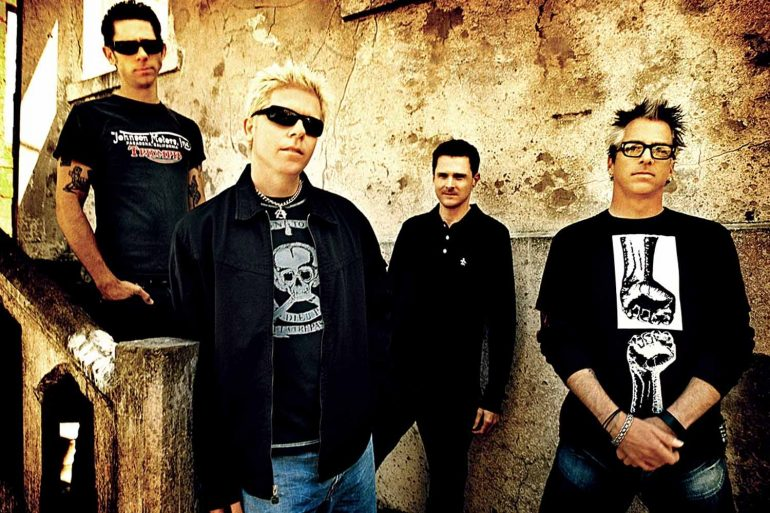

# Página de Tributo: The Offspring

Este é um projeto de uma página de tributo à banda de rock **The Offspring**, desenvolvido em HTML e CSS. A página contém uma introdução à história da banda, curiosidades e citações dos integrantes, proporcionando uma experiência visual e informativa para os fãs.

## 🎸 Visão Geral

A página apresenta:
- **Cabeçalho**: Nome da banda e uma breve descrição.
- **Imagem de Destaque**: Foto dos integrantes da banda com legenda.
- **Seção de Biografia**: Informações sobre os primeiros anos da banda e a formação do *The Offspring*.
- **Citações**: Blocos com frases de Dexter Holland e letras da música "The Kids Aren't Alright".
- **Curiosidades**: Fatos interessantes sobre os integrantes e a banda.
- **Imagem de Show**: Foto de um show ao vivo da banda, destacando o vocalista Dexter Holland.
- **Link para mais informações**: Redireciona o usuário para a página do *The Offspring* na Wikipedia.

## 🛠️ Estrutura do Projeto

- **index.html**: Estrutura principal da página, organizada em seções semânticas.
- **CSS/styles.css**: Arquivo de estilo que define o layout e o visual da página.

### Estrutura do HTML

O arquivo `index.html` contém a seguinte organização:

- `.container`: Contém toda a estrutura da página.
- `.header`: Título principal e descrição.
- `.featured-image`: Imagem destacada com legenda.
- `.biography-container`: Informações biográficas da banda.
- `.quotes-container`: Exibe citações da banda.
- `.curiosities-container`: Lista curiosidades sobre os integrantes e a banda.
- `.moreinfo-container`: Inclui um link para mais informações.

### Estrutura do CSS

O arquivo `styles.css` inclui estilos como:

- **Fundo** em cinza claro e branco para o conteúdo.
- **Fontes**: Helvetica para o conteúdo, com títulos em negrito.
- **Citações** em itálico e tamanho de fonte maior.
- **Bordas** tracejadas para separar as seções de biografia e curiosidades.

## 🚀 Como Executar o Projeto

1. Clone este repositório para sua máquina local:

   ```bash
   git clone https://github.com/seu-usuario/nome-do-repositorio.git

## 📸 Capturas de Tela

### Página Principal

*Integrantes da banda The Offspring.*

### Show ao Vivo

*Dexter Holland comandando a banda em um show.*
